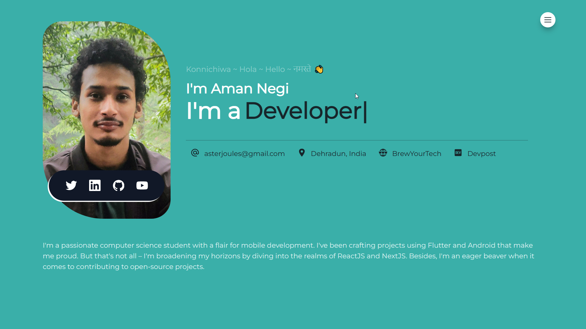
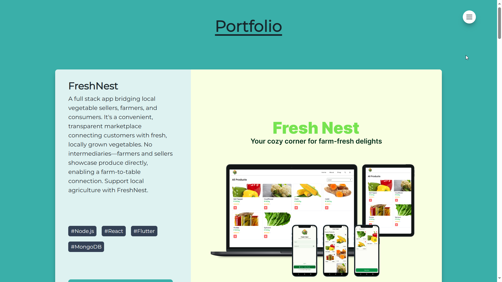
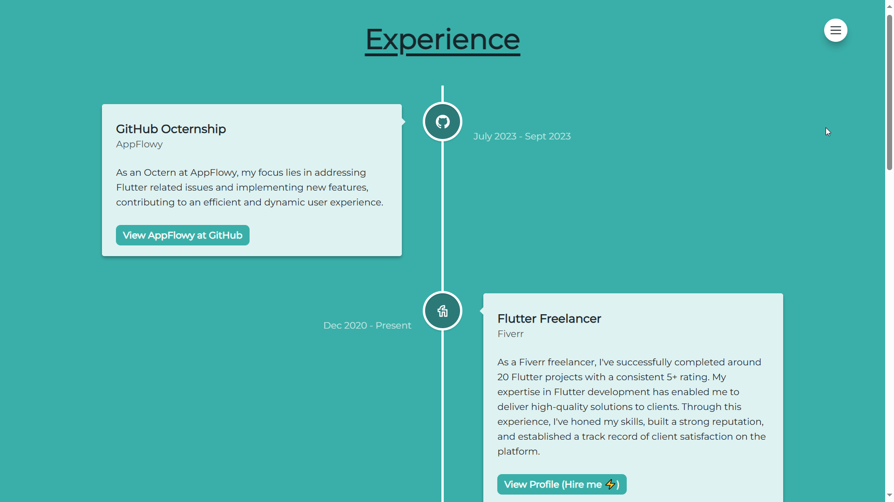

# Modern Portfolio 2023 🧱🌄

[](https://asterjoules.netlify.app)




## Overview

Modern Portfolio 2023 is a best-practices-oriented React application built with the latest technologies. It's designed to showcase your skills, projects, and experience in a modern and engaging way.

## Major Dependencies

- **Tailwind CSS & tailwind-merge:** Used for styling the application. Tailwind CSS is a utility-first CSS framework that allows for rapid prototyping and customization. `tailwind-merge` is a library for merging Tailwind CSS classes.

- **React & TypeScript:** The application is built with React and TypeScript, providing a robust and type-safe development experience.

- **framer-motion:** Used for animations in the application. This library provides a simple and powerful way to animate React components.

- **react-router-dom:** Handles navigation in the application. It allows for dynamic routing and navigation without a page reload.

- **react-icons:** Used for icons in the application. This library provides a wide range of icons from different icon packs.

## Getting Started

1. Clone the repository:
   ```
   git clone https://github.com/yourusername/modern-portfolio-2023.git
   ```
2. Install the dependencies and run the server:
   ```
   cd modern-portfolio-2023
   npm install
   npm run dev
   ```

## Contributing

Contributions are welcome! Please read the [contributing guide](CONTRIBUTING.md) to get started.

## License

This project is licensed under the terms of the [CC BY-NC-SA 4.0 DEED](LICENSE).

## Screenshots

<p float="left">
  
   
</p>
